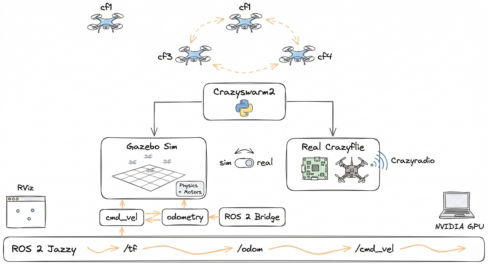

# Crazyswarm2 Gazebo Simulation

Crazyflie swarm simulation using **Crazyswarm2** + **Gazebo Harmonic** on **ROS 2 Jazzy**.

Write your swarm scripts once using the Crazyswarm2 Python API (`takeoff`, `land`, `goTo`, trajectories) and run them in Gazebo simulation. The architecture is designed so the same scripts can later run on real Crazyflie hardware by switching the backend.

## Architecture



Crazyswarm2 server runs the actual Crazyflie firmware (compiled to Python bindings) in a software-in-the-loop setup. A PD velocity controller converts desired states to `cmd_vel` commands, which flow through the ROS-Gazebo bridge to Gazebo Harmonic's multirotor physics engine. Odometry flows back the same way.

## Demos

### Swarm Demo
3 drones take off, form a circle, rotate through each other's positions, return to start, and land.


### Figure-8 Trajectory
All 3 drones execute a figure-8 piecewise polynomial trajectory uploaded from CSV.


### Multi-Trajectory
Each drone flies a different precomputed trajectory simultaneously.


### Formation Morphing
3 drones cycle through line → triangle → V-shape → circle → line formations, flown at staggered altitudes so transitions can't collide.


## Prerequisites

- **Ubuntu 24.04**
- **ROS 2 Jazzy** (desktop install)
- **Gazebo Harmonic** (gz sim 8)

Install ROS 2 and Gazebo:
```bash
# ROS 2 Jazzy
sudo apt install ros-jazzy-desktop ros-dev-tools

# Gazebo bridge
sudo apt install ros-jazzy-ros-gz

# Additional ROS packages
sudo apt install ros-jazzy-motion-capture-tracking ros-jazzy-tf-transformations
```

Install Python dependencies:
```bash
pip install rowan nicegui cflib transforms3d
```

## Setup

### 1. Clone this repo with submodules

```bash
git clone --recursive https://github.com/prakash-aryan/crazyswarm2_gazebo.git
cd crazyswarm2_gazebo
# Initialize nested submodules (crazyflie_tools inside the crazyswarm2 fork)
cd src/crazyswarm2 && git submodule update --init --recursive && cd ../..
```

This pulls three submodules:
- `src/crazyswarm2` — fork of IMRCLab/crazyswarm2 with the Gazebo backend
- `src/ros_gz_crazyflie` — fork of knmcguire/ros_gz_crazyflie with the 3-drone world, bridge, and launches
- `src/crazyflie_ros2_multiranger` — fork of knmcguire/crazyflie_ros2_multiranger with the takeoff timing fix

### 2. Build the Crazyflie firmware Python bindings

```bash
cd ~
git clone --recursive https://github.com/bitcraze/crazyflie-firmware.git
cd crazyflie-firmware
make cf2_defconfig
make bindings_python
```

### 3. Build the workspace

```bash
cd ~/crazyswarm2_gazebo
source /opt/ros/jazzy/setup.bash
colcon build --symlink-install --cmake-args -DCMAKE_BUILD_TYPE=Release
```

> **Important — Python version mismatch:** ROS 2 Jazzy requires **Python 3.12** (the system Python on Ubuntu 24.04). If you have a different Python version active (e.g. Python 3.14 via mise/pyenv), the build may succeed but packages will **fail at runtime** with missing module errors because the compiled `.so` bindings (e.g. from crazyflie-firmware) won't match.
>
> **Fix:** Disable your version manager and force the system Python before building **and** running:
> ```bash
> export MISE_DISABLED=1
> export PATH="/usr/bin:$PATH"
> python3 --version  # should show 3.12.x
> ```
> If you already built with the wrong Python, clean and rebuild:
> ```bash
> rm -rf build/ install/ log/
> colcon build --symlink-install --cmake-args -DCMAKE_BUILD_TYPE=Release
> ```

## Running the Simulation

### Terminal 1: Launch Gazebo + Crazyswarm2 + RViz

```bash
source /opt/ros/jazzy/setup.bash
source ~/crazyswarm2_gazebo/install/local_setup.bash
export PYTHONPATH="$HOME/crazyflie-firmware/build:$PYTHONPATH"
export GZ_SIM_RESOURCE_PATH="$(ros2 pkg prefix ros_gz_crazyflie_gazebo)/share/ros_gz_crazyflie_gazebo/models:$GZ_SIM_RESOURCE_PATH"

ros2 launch ros_gz_crazyflie_bringup gazebo_crazyswarm2.launch.py
```

This starts:
- Gazebo Harmonic with 3 Crazyflie drones (cf1, cf3, cf4)
- ROS-Gazebo bridge (cmd_vel, odometry, clock)
- Crazyswarm2 server with the Gazebo backend
- Consolidated TF publisher
- RViz with robot models

### Terminal 2: Run a demo script

```bash
source /opt/ros/jazzy/setup.bash
source ~/crazyswarm2_gazebo/install/local_setup.bash
export PYTHONPATH="$HOME/crazyflie-firmware/build:$PYTHONPATH"
```

All demos use the Crazyswarm2 Python API and require `use_sim_time`:

```bash
ros2 run crazyflie_examples <demo_name> --ros-args -p use_sim_time:=True
```

### Available demos

| Demo | Drones | Description |
|---|---|---|
| `hello_world` | 1 (cf1) | Single drone takeoff, hover 5s, land |
| `swarm_demo` | All 3 | Circle formation, rotate positions, return to start, land |
| `figure8` | All 3 | Upload and execute figure-8 polynomial trajectory from CSV |
| `multi_trajectory` | All 3 | Each drone flies a different trajectory |
| `leader_follower` | 2+ | cf1 leads a square path; cf3/cf4 follow at fixed offsets |
| `formation_morphing` | Any | Cycle through line, triangle, V, circle formations |
| `cmd_full_state` | 1 (cf1) | Stream full-state setpoints (pos/vel/acc/yaw/omega) at 30 Hz |
| `group_mask` | All 3 | Selectively command subsets of the swarm |

> **Note:** `swap` requires drone IDs 231/5 which are not configured in this setup. `nice_hover` requires an interactive button press. `infinite_flight` and `arming` are for real hardware only.

## Mapping + Wall Following (Multi-Ranger Deck)

The [crazyflie_ros2_multiranger](https://github.com/knmcguire/crazyflie_ros2_multiranger) submodule provides a simple occupancy-grid mapper and a wall-following state machine that use the simulated multi-ranger deck (4 range sensors) and Flow deck odometry. Each Crazyflie in the world has a 4-ray `gpu_lidar` sensor attached to its body link — mimicking the real multi-ranger deck.

### Single-drone mapping + wall following (cf1)

```bash
source /opt/ros/jazzy/setup.bash
source ~/crazyswarm2_gazebo/install/local_setup.bash
export GZ_SIM_RESOURCE_PATH="$(ros2 pkg prefix ros_gz_crazyflie_gazebo)/share/ros_gz_crazyflie_gazebo/models:$GZ_SIM_RESOURCE_PATH"

ros2 launch ros_gz_crazyflie_bringup cf1_mapper_wall_follower.launch.py
```

This starts Gazebo, the ROS-Gazebo bridge, a `control_services` node for takeoff/altitude-hold, the `simple_mapper` and `wall_following` nodes from `crazyflie_ros2_multiranger`, and RViz with a map+scan configuration. After a ~10-second startup delay, cf1 autonomously takes off, follows a wall, and builds an occupancy grid published on `/cf1/map`.

### 3-drone swarm mapping + wall following

```bash
source /opt/ros/jazzy/setup.bash
source ~/crazyswarm2_gazebo/install/local_setup.bash
export GZ_SIM_RESOURCE_PATH="$(ros2 pkg prefix ros_gz_crazyflie_gazebo)/share/ros_gz_crazyflie_gazebo/models:$GZ_SIM_RESOURCE_PATH"

ros2 launch ros_gz_crazyflie_bringup swarm_mapper_wall_follower.launch.py
```

All three drones (cf1, cf3, cf4) take off simultaneously, each with its own mapper and wall-follower. Per-drone topic isolation is done via ROS 2 remappings so their `/cmd_vel` streams don't collide. RViz shows map overlays, per-drone scans, and robot models.

**Note:** These mapping launches do *not* use Crazyswarm2 — they use the simpler `control_services` node from `ros_gz_crazyflie` to handle takeoff/altitude-hold while the wall follower publishes raw `/cmd_vel` commands. Switching the same mapper/wall-follower nodes to real hardware requires Crazyswarm2's `cflib` backend driving a real multi-ranger + Flow deck.

## Writing Your Own Swarm Scripts

Use the standard Crazyswarm2 Python API:

```python
from crazyflie_py import Crazyswarm

def main():
    swarm = Crazyswarm()
    timeHelper = swarm.timeHelper
    allcfs = swarm.allcfs

    # Takeoff all drones
    allcfs.takeoff(targetHeight=1.0, duration=3.0)
    timeHelper.sleep(4.0)

    # Command individual drones
    for cf in allcfs.crazyflies:
        cf.goTo([0.0, 0.0, 1.0], 0, 3.0)
    timeHelper.sleep(4.0)

    # Land
    allcfs.land(targetHeight=0.04, duration=3.0)
    timeHelper.sleep(4.0)

if __name__ == '__main__':
    main()
```

## Configuration

### Drone positions

Edit `src/crazyswarm2/crazyflie/config/crazyflies.yaml` to change drone count and positions. Ensure positions match the `<pose>` values in `src/ros_gz_crazyflie/ros_gz_crazyflie_gazebo/worlds/crazyflie_swarm_world.sdf`.

### Gazebo backend tuning

The PD gains in `src/crazyswarm2/crazyflie_sim/crazyflie_sim/backend/gazebo.py`:
```python
self.kp_pos = np.array([0.8, 0.8, 1.0])   # Position proportional gain
self.kd_vel = np.array([0.5, 0.5, 0.5])   # Velocity damping
self.kff_vel = np.array([0.3, 0.3, 0.3])  # Velocity feedforward
self.max_vel = 1.0                          # Max velocity clamp (m/s)
```

## What We Built

- **Gazebo backend** for Crazyswarm2 — a new `gazebo.py` backend that bridges the SIL firmware to Gazebo Harmonic via velocity commands and odometry
- **3-drone world** SDF with Crazyflie multirotor physics (motor models, velocity controllers)
- **Simulated multi-ranger deck** — 4-ray `gpu_lidar` on each drone's body link, same topology as the real Bitcraze multi-ranger
- **ROS-Gazebo bridge** config for cmd_vel, odometry, enable, scan, and clock topics
- **Consolidated TF publisher** to avoid time-jump issues with multiple odometry sources
- **Swarm demo script** showing coordinated multi-drone flight
- **PD controller tuning** with velocity clamping for stable trajectory tracking
- **Single-drone and swarm mapping + wall-following** launches that drive the `crazyflie_ros2_multiranger` mapper/wall-follower from the simulated multi-ranger data

## Roadmap

- [x] Multi-ranger + Flow deck mapping and wall following (via [crazyflie_ros2_multiranger](https://github.com/knmcguire/crazyflie_ros2_multiranger))
- [ ] Test with real Crazyflie hardware (switch backend to `cflib` or `cpp`)
- [ ] Full SLAM with slam_toolbox and Nav2 autonomous navigation
- [ ] Leader-follower formation flying
- [ ] Scale to 10+ drones
- [ ] Integration with motion planning (db-CBS trajectory planner)

## Project Structure

```
crazyswarm2_gazebo/
├── src/
│   ├── crazyswarm2/                    # Fork of IMRCLab/crazyswarm2
│   │   ├── crazyflie/config/           # Drone definitions + backend=gazebo
│   │   ├── crazyflie_sim/backend/
│   │   │   └── gazebo.py               # Gazebo backend (NEW)
│   │   └── crazyflie_examples/
│   │       └── swarm_demo.py           # Swarm demo script (NEW)
│   ├── ros_gz_crazyflie/               # Fork of knmcguire/ros_gz_crazyflie
│   │   ├── ros_gz_crazyflie_bringup/
│   │   │   ├── config/                 # Bridge + RViz configs
│   │   │   └── launch/                 # gazebo_crazyswarm2, cf1_mapper_wall_follower,
│   │   │                               #   swarm_mapper_wall_follower
│   │   ├── ros_gz_crazyflie_control/
│   │   │   ├── control_services.py     # Cmd_vel relay + takeoff/altitude-hold
│   │   │   └── odom_tf_publisher.py    # Consolidated TF publisher
│   │   └── ros_gz_crazyflie_gazebo/
│   │       ├── models/crazyflie/       # URDF with props for RViz
│   │       └── worlds/                 # Swarm world with 3 drones + multi-ranger lidars
│   └── crazyflie_ros2_multiranger/     # Fork of knmcguire/crazyflie_ros2_multiranger
│       ├── ..._simple_mapper/          # Occupancy-grid mapper from 4-ray scan
│       └── ..._wall_following/         # Autonomous wall-following state machine
├── docs/media/                         # Demo GIFs and architecture diagram
└── README.md
```

## Acknowledgments

Built on top of:
- [Crazyswarm2](https://github.com/IMRCLab/crazyswarm2) by IMRCLab
- [ros_gz_crazyflie](https://github.com/knmcguire/ros_gz_crazyflie) by Kimberly McGuire / Bitcraze
- [crazyflie_ros2_multiranger](https://github.com/knmcguire/crazyflie_ros2_multiranger) by Kimberly McGuire / Bitcraze
- [Crazyflie firmware](https://github.com/bitcraze/crazyflie-firmware) by Bitcraze
